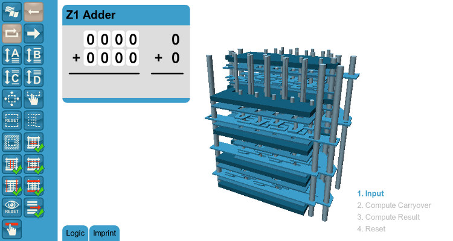

zuse-z1.js
==========

### WebGL simulations of Konrad Zuse's Z1 computer ###

[View the simulation](https://daign.github.io/zuse-z1.js/)

Licensed under [MIT License](./LICENSE.txt)

Dependencies:
* [three.js](https://github.com/mrdoob/three.js)
* [tween.js](https://github.com/sole/tween.js)

---

This project is part of the [Konrad Zuse Internet Archive](http://zuse.zib.de/).

A copy of the [simulation is hosted on their website](http://zuse-z1.zib.de/).
There also is a [short video](http://zuse-z1.zib.de/simulations/z1/adders/wgl/videos/z1-simulation.mp4) in German.

The simulation of the adder is based on the paper "Rechenvorrichtungen aus mechanischen Schaltgliedern" by Konrad Zuse:
* http://www.zib.de/zuse/Inhalt/Texte/Chrono/50er/Pdf/0169.pdf
* http://www.zib.de/zuse/Inhalt/Texte/Chrono/50er/Pdf/0169scan.pdf

### For developers ###

* [Adder project todo](./adder/Todo.md)

